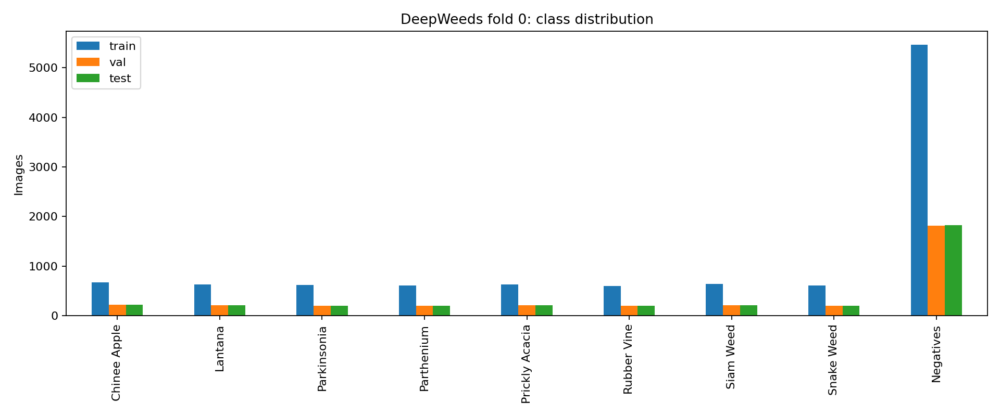
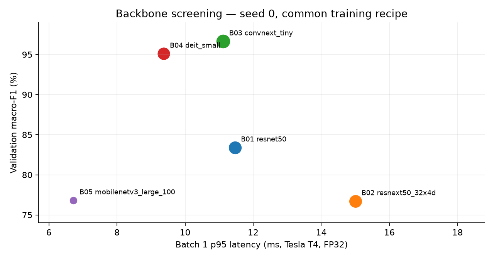
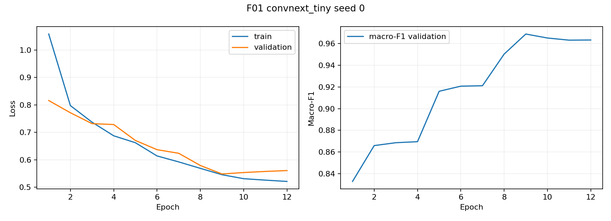
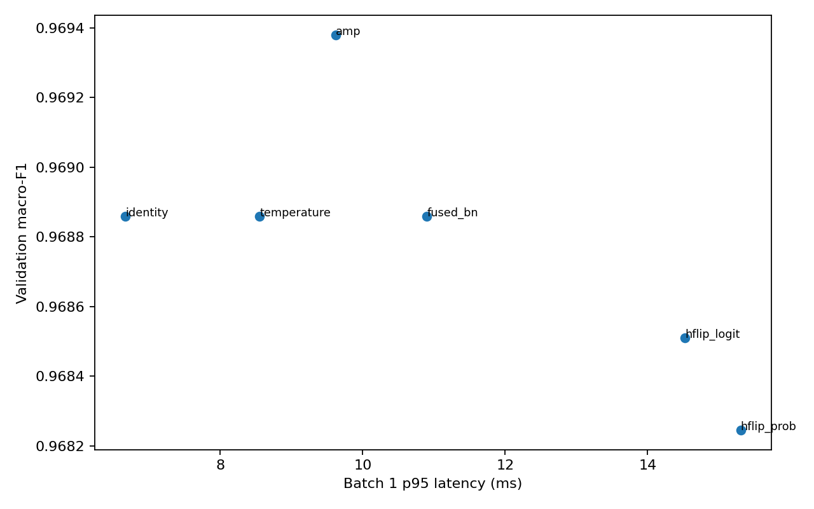
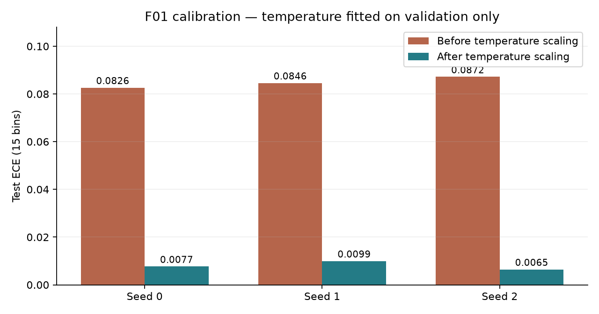
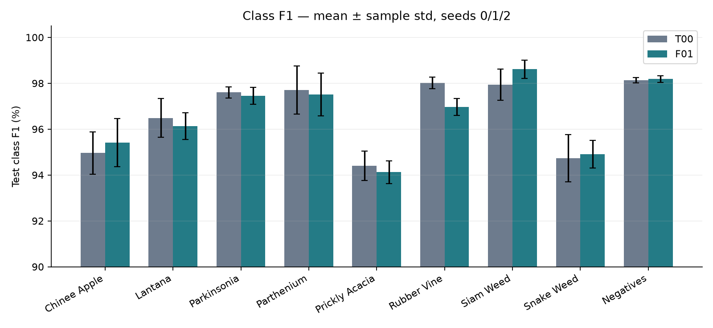
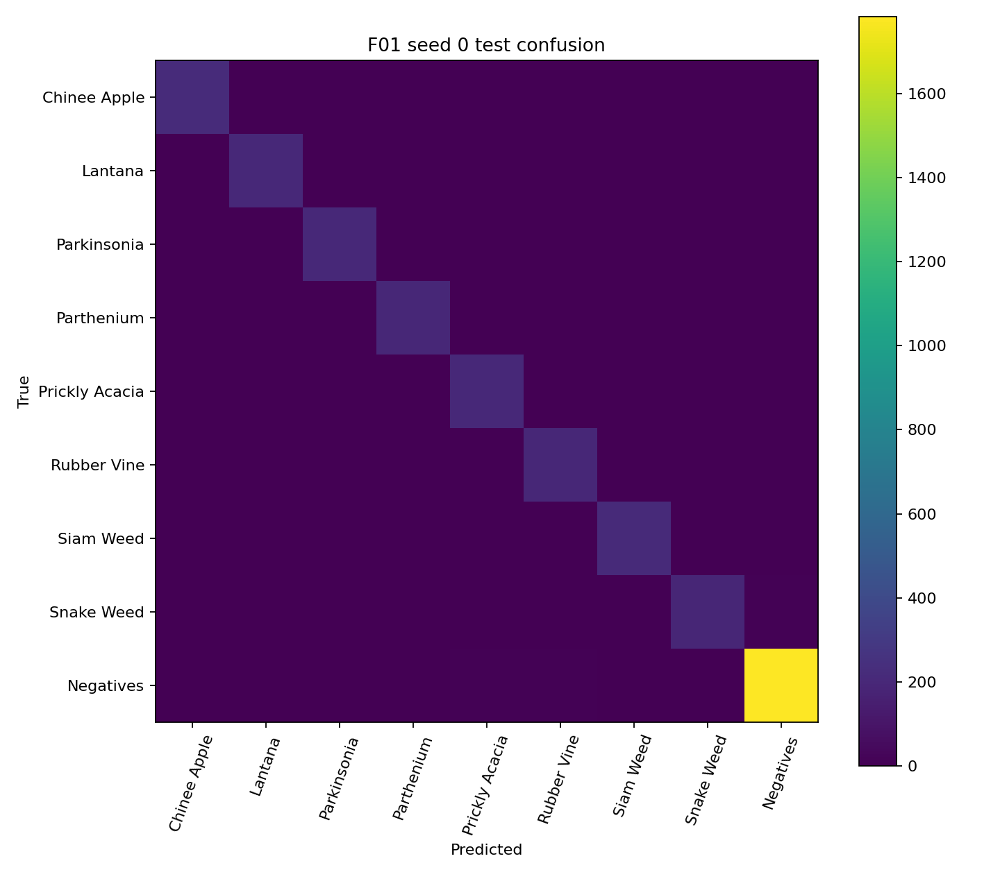
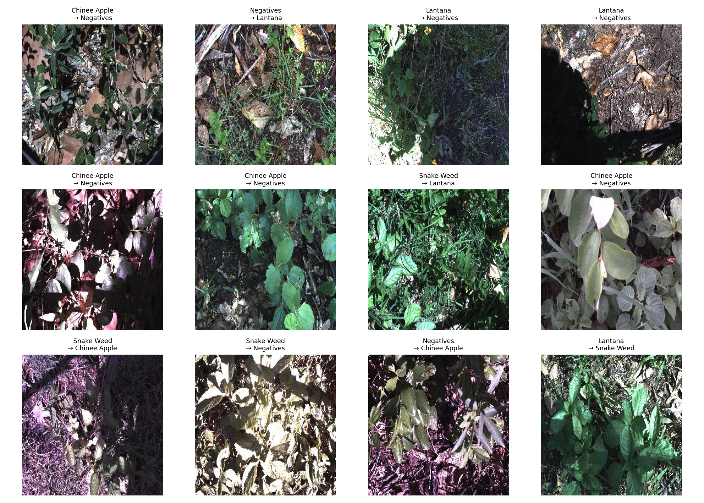

# Báo cáo Lab Day 2 — Backbone, huấn luyện và suy luận trên DeepWeeds

**Sinh viên:** Nguyễn Văn Giáp · **MSSV:** 2A202602903  
**Phạm vi:** DeepWeeds, fold 0; chạy trên Colab và tiếp tục checkpoint trên Kaggle.

## 1. Tóm tắt

Bài làm so sánh 5 backbone, 3 trục huấn luyện và 5 phương pháp suy luận ngoài mốc một view.
ConvNeXt-Tiny được chọn trên validation; cấu hình chung kết F01 dùng finetune, label smoothing 0,1 và temperature scaling khớp trên validation của từng seed.
Qua seed 0/1/2, F01 đạt **top-1 test 97.31 ± 0.27%**, **macro-F1 test 96.59 ± 0.39%** và **ECE 0.008026 ± 0.001771**.
Mốc T00 đạt macro-F1 **96.66 ± 0.34%**; chênh lệch F01 − T00 là **-0.075 điểm phần trăm**, nên kết quả chưa chứng minh F01 phân loại tốt hơn mốc.
Temperature scaling giảm ECE của chính F01 khoảng **90.54%**, giữ nguyên nhãn dự đoán và macro-F1.
Độ trễ p95 cao nhất của F01 qua 3 seed là **10.996 ms** trên Tesla T4, batch 1, FP32, chưa tính đọc và tiền xử lý ảnh.
Kết luận chính là chọn backbone/trọng số phù hợp có ảnh hưởng lớn; lợi ích rõ nhất của bước suy luận là hiệu chuẩn xác suất.

## 2. Dữ liệu, thiết lập và kiểm tra pipeline

### 2.1. DeepWeeds và fold 0

Dùng 17.509 ảnh, 9 lớp. Các file `train_subset0.csv`, `val_subset0.csv`, `test_subset0.csv` quyết định split và nhãn dùng trong từng tập. Số đếm thực tế là **10.501 train / 3.501 val / 3.507 test**, tương ứng **59,975% / 19,995% / 20,030%**. `curves/split_checks.json` ghi giao từng cặp tập bằng 0; hợp ba tập có đủ 17.509 tên ảnh. Code kiểm tra file ảnh tồn tại trước khi train; khi viết báo cáo, đã đối chiếu lại tên ảnh và nhãn của toàn bộ 25 file dự đoán với CSV split tương ứng.

| Label | Lớp | Train | Val | Test | Tổng trong labels.csv |
| --- | --- | --- | --- | --- | --- |
| 0 | Chinee Apple | 675 | 225 | 226 | 1125 |
| 1 | Lantana | 637 | 213 | 213 | 1064 |
| 2 | Parkinsonia | 618 | 206 | 207 | 1031 |
| 3 | Parthenium | 613 | 204 | 205 | 1022 |
| 4 | Prickly Acacia | 637 | 212 | 213 | 1062 |
| 5 | Rubber Vine | 605 | 202 | 202 | 1009 |
| 6 | Siam Weed | 644 | 215 | 215 | 1074 |
| 7 | Snake Weed | 609 | 203 | 204 | 1016 |
| 8 | Negatives | 5463 | 1821 | 1822 | 9106 |
|  | Tổng | 10501 | 3501 | 3507 | 17509 |

**Khác biệt nhãn cần ghi nhận:** `20170714-110407-3.jpg` thuộc train, có `Label=0` trong `train_subset0.csv` nhưng `Label=1` (Lantana) trong `labels.csv`. Vì vậy, tổng nhãn của ba split là 1.126 Chinee Apple và 1.063 Lantana, trong khi `labels.csv` ghi 1.125 và 1.064. Đã đối chiếu và xác nhận khác biệt này cũng tồn tại trong [train_subset0.csv của tác giả](https://raw.githubusercontent.com/AlexOlsen/DeepWeeds/master/labels/train_subset0.csv) và [labels.csv của tác giả](https://raw.githubusercontent.com/AlexOlsen/DeepWeeds/master/labels/labels.csv). Báo cáo giữ nguyên dữ liệu và dùng nhãn CSV split để tính chỉ số, không tự sửa nhãn. Cần xác minh nhãn đúng trước vòng thực nghiệm dữ liệu tiếp theo.

`Negatives` có 9.106 ảnh, khoảng **52,01%** toàn bộ dữ liệu; các lớp còn lại khoảng 1.000 ảnh/lớp. Accuracy chịu ảnh hưởng của lớp lớn, nên macro-F1 của đủ 9 lớp là chỉ số chính; báo cáo kèm balanced accuracy, chỉ số từng lớp và ECE 15 bin.



Ảnh mẫu 3 ảnh/lớp được lưu trong [EDA_examples.png](curves/EDA_examples.png). Train chỉ cập nhật trọng số; val chọn checkpoint, backbone, công thức và suy luận, đồng thời khớp nhiệt độ. Quyết định trước test được lưu trong [selection.json](selection.json). Code chỉ bật dự đoán test ở vòng chung kết và dùng lại CSV/logit đã lưu khi khôi phục phiên.

### 2.2. Công thức nền và môi trường

T00 dùng backbone đã chọn, finetune toàn mạng, ảnh 224×224, batch 32, 12 epoch, AdamW; LR backbone 1e-4, LR head 1e-3, weight decay 0,05 với bias/norm được loại khỏi decay. Lịch LR gồm warmup 1 epoch rồi cosine. Train bật AMP; không EMA, không sampler cân bằng, không Mixup/CutMix trong các run huấn luyện đã báo cáo. Batch 32 là điều chỉnh từ batch 64 tham khảo để phù hợp VRAM và được dùng thống nhất.

Train dùng RandomResizedCrop và lật ngang; val/test dùng resize cạnh ngắn 256, center crop 224 và chuẩn hóa ImageNet. Chọn checkpoint có macro-F1 val cao nhất, giữ epoch sớm hơn khi hòa. Sàng lọc dùng seed 0; chung kết dùng seed 0/1/2. Ký hiệu **mean ± std** là trung bình và **độ lệch chuẩn mẫu, ddof=1**, không phải khoảng tin cậy.

| Thành phần | Colab | Kaggle sau chuyển phiên |
|---|---|---|
| GPU | Tesla T4 | Tesla T4 |
| Python | 3.13.15 | 3.13.15 |
| PyTorch | 2.11.0+cu130 | 2.11.0+cu128 |
| torchvision | 0.26.0+cu130 | 0.26.0+cu128 |
| timm | 1.0.20 | 1.0.20 |
| NumPy / pandas | 2.1.3 / 2.2.3 | 2.1.3 / 2.3.3 |

Môi trường lấy từ `environment-pip-original.txt`, `environment-pip.txt` và `runs/*/seed*/environment.json`. B01–B05, T01–T05, T00 seed 0/1 và F01 seed 0 lưu phép đo với cu130; F01 seed 1 tiếp tục trên cu128, còn T00/F01 seed 2 dùng cu128. [migration.json](migration.json) lưu môi trường trước chuyển phiên. Khác biệt phần mềm và trạng thái máy cần được xét khi so sánh thời gian; std chung kết cũng có thể chịu tác động của thay đổi môi trường.

### 2.3. Bằng chứng kiểm tra pipeline

Tham chiếu lý thuyết của CE với dự đoán đều 9 lớp là ln(9) ≈ 2,197; đây không phải số đo loss ban đầu của thí nghiệm. [Biểu đồ overfit một batch](curves/pipeline_overfit.png) cho thấy loss giảm về gần 0 sau khoảng 12 bước tối ưu, hỗ trợ kiểm tra kết nối ảnh–nhãn–model–optimizer. [Ảnh augmentation/CutMix](curves/pipeline_augmentation.png) là bằng chứng kiểm tra kỹ thuật; CutMix ở đây không phải một ablation huấn luyện trong bảng kết quả.

## 3. So sánh backbone

Tất cả B01–B05 dùng cùng split, seed 0, công thức nền, batch và số epoch. Bảng lấy từ sheet `Backbones` và `all_results.json`; phần trăm là giá trị ×100.

| ID | Backbone | Params (M) | GMAC | Macro-F1 val (%) | Top-1 val (%) | Train s/epoch | p95 ms |
| --- | --- | --- | --- | --- | --- | --- | --- |
| B01 | resnet50 | 23.526 | 4.109 | 83.406 | 87.746 | 55.13 | 11.465 |
| B02 | resnext50_32x4d | 22.998 | 4.257 | 76.716 | 81.520 | 61.62 | 15.003 |
| B03 | convnext_tiny | 27.827 | 4.470 | 96.643 | 97.458 | 66.57 | 11.118 |
| B04 | deit_small_patch16_224 | 21.669 | 4.250 | 95.100 | 96.572 | 50.75 | 9.376 |
| B05 | mobilenetv3_large_100 | 4.214 | 0.224 | 76.817 | 83.262 | 44.99 | 6.722 |

ConvNeXt-Tiny đạt macro-F1 val **96,643%**, cao hơn ResNet-50 **13.237 điểm phần trăm** và DeiT-Small **1,542 điểm phần trăm**. Với p95 **11,118 ms**, B03 có độ chính xác tốt trong ngân sách model 30–100 ms, nên được chọn đi tiếp. DeiT-Small là lựa chọn đáng xem xét khi cần giảm thời gian train và độ trễ; MobileNetV3 có ít tham số/GMAC và p95 thấp nhất trong bảng nhưng macro-F1 thấp hơn rõ rệt.



**Giới hạn của so sánh:** trọng số ConvNeXt là `convnext_tiny.in12k_ft_in1k`, được tiền huấn luyện trên ImageNet-12k rồi tinh chỉnh ImageNet-1k theo [model card chính thức](https://huggingface.co/timm/convnext_tiny.in12k_ft_in1k). Vì nguồn/công thức pretrained khác giữa các backbone, kết quả phản ánh cả kiến trúc và trọng số khởi tạo; chưa thể quy toàn bộ lợi thế cho kiến trúc ConvNeXt. Params được đếm sau thay head 9 lớp; GMAC dùng fvcore với một multiply-add tính là một operation và bỏ qua operation chưa hỗ trợ.

Đường cong B01 đạt đỉnh ở epoch 11 rồi giảm nhẹ ở epoch 12. B02 và B05 có checkpoint tốt nhất tại epoch 7, sau đó train loss vẫn giảm nhưng macro-F1 val không vượt đỉnh cũ. B03 và B04 đạt checkpoint tốt nhất tại epoch 12, gợi ý 12 epoch chưa phải bằng chứng đã tối ưu hoàn toàn mọi backbone. Chi tiết nằm ở `runs/B*/seed0/history.csv` và `curves/B*_seed0.png`.

## 4. Ablation công thức huấn luyện

Ba trục được thử trên ConvNeXt-Tiny: finetune/frozen; augmentation basic/color; loss CE/label smoothing/focal. T01–T04 chỉ khác T00 theo một yếu tố/trục; T05 dùng các yếu tố cải thiện val.

| ID | Thay đổi so với T00 | Macro-F1 val (%) | Δ F1 (điểm %) | ECE val | Best epoch |
| --- | --- | --- | --- | --- | --- |
| T00 | CE, finetune, basic | 96.643 | +0.000 | 0.017269 | 12 |
| T01 | Đóng băng backbone | 85.716 | -10.927 | 0.025276 | 12 |
| T02 | Thêm ColorJitter | 96.595 | -0.047 | 0.019216 | 10 |
| T03 | Label smoothing ε=0,1 | 96.886 | +0.243 | 0.087475 | 9 |
| T04 | Focal γ=2 | 96.660 | +0.017 | 0.021965 | 11 |
| T05 | Kết hợp được chọn: chỉ LS ε=0,1 | 96.886 | +0.243 | 0.087475 | 9 |

**Finetune quan trọng nhất trong các trục đã thử.** Đóng băng backbone làm macro-F1 giảm **10,927 điểm phần trăm** dù train nhanh hơn (38,86 so với 66,78 s/epoch). Kết quả phù hợp với nhu cầu điều chỉnh đặc trưng pretrained cho ảnh cỏ dại, nhưng chỉ chứng minh trên công thức và seed đang xét.

ColorJitter giảm macro-F1 khoảng **0,047 điểm phần trăm**; focal tăng khoảng **0,017 điểm phần trăm**. Các thay đổi này nhỏ, không đủ để kết luận về hiệu quả ổn định khi mỗi ablation chỉ dùng một seed. Label smoothing tăng **0,243 điểm phần trăm** trên val, song ECE tăng từ **0,017269 lên 0,087475** trước hiệu chuẩn; tăng F1 không đồng nghĩa xác suất đã được hiệu chuẩn tốt hơn.

**T05 không tạo ra kết hợp nhiều trục:** chỉ label smoothing được giữ lại nên cấu hình T05 trùng T03. Hai file dự đoán val T03/T05 giống nhau hoàn toàn. T05 được chọn trong nhóm đồng hạng theo p95 đo được thấp hơn; không dùng lần chạy này làm bằng chứng hiệu ứng cộng dồn giữa augmentation, khởi tạo và loss. Đây là hạn chế của thí nghiệm kết hợp.



F01 seed 0 đạt đỉnh F1 val ở epoch 9 (**96,886%**); đến epoch 12 còn **96,336%**. Trong cùng đoạn, train loss giảm **0,5455 → 0,5210**, val loss tăng **0,5482 → 0,5606**. Vì vậy checkpoint epoch 9 phù hợp hơn epoch cuối. Loss CE, label smoothing và focal có định nghĩa khác nhau, nên không so trực tiếp độ lớn loss giữa các công thức để kết luận công thức nào tốt hơn.

## 5. Suy luận và hiệu chuẩn

Các phương pháp I00–I05 dùng checkpoint T05 seed 0 và đánh giá trên val. Độ trễ đo ở batch 1, ảnh 224, 10 warmup, 100 lần, đồng bộ CUDA trước/sau; chỉ gồm model và hậu xử lý của phương pháp suy luận. I00–I04 dùng FP32; I05 dùng autocast AMP.

| ID | Phương pháp | Views | Macro-F1 val (%) | ECE val | p50 ms | p95 ms | p99 ms |
| --- | --- | --- | --- | --- | --- | --- | --- |
| I00 | identity | 1 | 96.886 | 0.087475 | 6.148 | 6.669 | 9.200 |
| I01 | hflip_prob | 2 | 96.825 | 0.087266 | 12.214 | 15.303 | 20.879 |
| I02 | hflip_logit | 2 | 96.851 | 0.085890 | 12.684 | 14.523 | 19.812 |
| I03 | temperature | 1 | 96.886 | 0.005822 | 6.266 | 8.552 | 9.999 |
| I04 | fused_bn | 1 | 96.886 | 0.087475 | 8.047 | 10.901 | 11.462 |
| I05 | amp | 1 | 96.938 | 0.086912 | 7.971 | 9.620 | 12.704 |

TTA hai view gần gấp đôi chi phí p50 nhưng không tăng F1: gộp probability giảm khoảng **0,061 điểm phần trăm**, gộp logit giảm **0,035 điểm phần trăm** so với I00. Không chọn TTA cho chung kết từ kết quả này. Gộp BN và AMP cũng không cho tăng tốc trong phiên đo; không mặc định chúng nhanh hơn FP32.

I05 có macro-F1 val cao nhất bảng (**96,938%**), nhỉnh hơn I00 khoảng **0,052 điểm phần trăm**. Tuy nhiên, code chung kết hiện hỗ trợ identity, hflip_prob, hflip_logit và temperature; AMP suy luận chưa nằm trong tập phương pháp được chạy chung kết. Do đó không mô tả I03 là phương pháp F1 cao nhất trong toàn bộ bảng. Trong tập ứng viên được hỗ trợ, I03 giữ F1 ngang I00 và giảm ECE, nên được chọn theo F1 → ECE → p95.



### 5.1. Temperature scaling

Trên val seed 0, I03 có **T=0,643973**, ECE giảm **0,087475 → 0,005822** (khoảng **93.34%**), NLL giảm **0,167620 → 0,100026**. Mỗi seed chung kết khớp T riêng trên val rồi áp dụng nguyên sang test; không khớp T bằng test.

| Seed | T từ val | ECE test trước | ECE test sau | NLL test trước | NLL test sau |
| --- | --- | --- | --- | --- | --- |
| 0 | 0.643973 | 0.082637 | 0.007673 | 0.171941 | 0.106060 |
| 1 | 0.654160 | 0.084594 | 0.009946 | 0.169679 | 0.105338 |
| 2 | 0.646416 | 0.087174 | 0.006458 | 0.163203 | 0.093578 |

Qua 3 seed, ECE test của F01 giảm **0.084802 ± 0.002276 → 0.008026 ± 0.001771**, tương đương giảm **90.54%** theo tỷ lệ của hai giá trị trung bình. NLL test giảm **0.168274 ± 0.004535 → 0.101659 ± 0.007007**. T<1 làm phân bố softmax sắc hơn; kết quả cho thấy hiệu chuẩn có ích với xác suất của mô hình label smoothing này.

Đã đối chiếu từng cặp `F01_uncal_seed*_test.csv` và `F01_seed*_test.csv`: tên ảnh và nhãn dự đoán giống nhau hoàn toàn. Temperature scaling không làm đổi accuracy/macro-F1 trong các file này; lợi ích nằm ở độ tin cậy xác suất.



## 6. Cấu hình chốt và kết quả chung kết

### 6.1. Cấu hình tái lập

| Thành phần | T00 — mốc | F01 — cấu hình chốt trên val |
|---|---|---|
| Backbone / trọng số | ConvNeXt-Tiny / `convnext_tiny.in12k_ft_in1k` | Như T00 |
| Khởi tạo | Pretrained, finetune toàn mạng | Như T00 |
| Split / seed | Fold 0 / 0, 1, 2 | Như T00 |
| Ảnh / batch / epoch | 224×224 / 32 / 12 | Như T00 |
| Augmentation | RandomResizedCrop + horizontal flip | Như T00 |
| Loss | Cross-entropy | Label smoothing ε=0,1 |
| Optimizer | AdamW; LR backbone 1e-4, head 1e-3, WD 0,05 | Như T00 |
| Scheduler / AMP train | Warmup 1 epoch + cosine / bật | Như T00 |
| EMA / Mixup / CutMix / balanced sampler | Không dùng | Không dùng |
| Suy luận | Một view, FP32, T=1 | Một view, FP32, T khớp trên val từng seed |
| Chọn checkpoint | Macro-F1 val cao nhất | Như T00 |

Cấu hình đầy đủ và môi trường từng run nằm trong `runs/T00/seed*/` và `runs/F01/seed*/`. Không chọn seed có test tốt nhất làm đại diện chung kết; báo cáo toàn bộ 3 seed.

### 6.2. Mean ± std và từng seed

| Chỉ số | T00 | F01 |
| --- | --- | --- |
| Macro-F1 val (%) | 96.592 ± 0.253 | 96.874 ± 0.091 |
| Macro-F1 test (%) | 96.662 ± 0.343 | 96.587 ± 0.394 |
| Top-1 test (%) | 97.320 ± 0.206 | 97.310 ± 0.274 |
| Balanced accuracy test (%) | 97.233 ± 0.537 | 96.845 ± 0.234 |
| ECE test (0–1) | 0.015026 ± 0.001981 | 0.008026 ± 0.001771 |
| NLL test | 0.102444 ± 0.004813 | 0.101659 ± 0.007007 |

| ID | Seed | Best epoch | F1 val (%) | Top-1 test (%) | F1 test (%) | ECE test | p95 ms |
| --- | --- | --- | --- | --- | --- | --- | --- |
| T00 | 0 | 12 | 96.643 | 97.377 | 96.839 | 0.015486 | 9.938 |
| F01 | 0 | 9 | 96.886 | 97.263 | 96.580 | 0.007673 | 10.996 |
| T00 | 1 | 12 | 96.317 | 97.092 | 96.267 | 0.016737 | 10.643 |
| F01 | 1 | 10 | 96.959 | 97.063 | 96.196 | 0.009946 | 9.389 |
| T00 | 2 | 12 | 96.815 | 97.491 | 96.880 | 0.012856 | 6.108 |
| F01 | 2 | 11 | 96.777 | 97.605 | 96.985 | 0.006458 | 6.331 |

Macro-F1 test của F01 − T00 là **-0.075 điểm phần trăm**; độ lệch chuẩn lớn hơn trong hai nhóm là **0.394 điểm phần trăm**. F01 thấp hơn T00 ở seed 0/1 và cao hơn ở seed 2. Cả giá trị trung bình và sự không nhất quán theo seed đều không hỗ trợ kết luận F01 cải thiện phân loại so với mốc. Accuracy trung bình gần như bằng nhau; cộng ba lần đánh giá, F01 có 283 lỗi còn T00 có 282 lỗi.

F01 có std macro-F1 test **0,394 điểm phần trăm**, lớn hơn T00 **0,343 điểm phần trăm**; chưa chứng minh label smoothing làm kết quả giữa seed ổn định hơn. Chênh lệch F1 val − test trung bình của F01 là **0.287 điểm phần trăm**. ECE của F01 thấp hơn T00, song phép so sánh nhân quả rõ nhất cho calibration vẫn là F01 trước/sau TS trên cùng trọng số.

F01 vẫn là cấu hình đã chốt trên validation. Việc T00 có F1 test trung bình nhỉnh hơn chỉ được dùng để báo cáo và đánh giá giả thuyết, không dùng để đổi cấu hình sau khi xem test. File `eval_out/grade_I.json` đề xuất **15/20 điểm phần I**: I1=7, I2=0, I3=4, I4=2, I5=2; đây là tự chấm theo ngưỡng tạm thời của đề bài, không phải điểm cuối cùng của giảng viên.

## 7. Chỉ số từng lớp và phân tích lỗi

### 7.1. Precision, recall, F1

Các giá trị dưới đây là phần trăm, mean ± std qua 3 seed. Support là số ảnh của một lần đánh giá test, không nhân ba. Δ F1 = F01 − T00.

| Lớp | Support | Precision F01 (%) | Recall F01 (%) | F1 F01 (%) | F1 T00 (%) | Δ F1 (điểm %) |
| --- | --- | --- | --- | --- | --- | --- |
| Chinee Apple | 226 | 95.70 ± 0.94 | 95.13 ± 1.17 | 95.41 ± 1.06 | 94.96 ± 0.93 | +0.456 |
| Lantana | 213 | 95.11 ± 0.90 | 97.18 ± 0.94 | 96.13 ± 0.58 | 96.49 ± 0.85 | -0.357 |
| Parkinsonia | 207 | 96.53 ± 0.69 | 98.39 ± 0.74 | 97.45 ± 0.36 | 97.60 ± 0.25 | -0.155 |
| Parthenium | 205 | 99.50 ± 0.50 | 95.61 ± 2.13 | 97.50 ± 0.93 | 97.70 ± 1.06 | -0.199 |
| Prickly Acacia | 213 | 91.98 ± 1.83 | 96.40 ± 0.98 | 94.12 ± 0.49 | 94.40 ± 0.64 | -0.276 |
| Rubber Vine | 202 | 96.57 ± 0.82 | 97.36 ± 0.57 | 96.96 ± 0.37 | 98.02 ± 0.25 | -1.056 |
| Siam Weed | 215 | 98.01 ± 0.27 | 99.22 ± 0.54 | 98.61 ± 0.40 | 97.93 ± 0.68 | +0.680 |
| Snake Weed | 204 | 95.40 ± 1.14 | 94.44 ± 1.58 | 94.91 ± 0.59 | 94.73 ± 1.02 | +0.178 |
| Negatives | 1822 | 98.51 ± 0.22 | 97.86 ± 0.33 | 98.18 ± 0.15 | 98.13 ± 0.11 | +0.052 |

Hai lớp cần theo dõi là **Chinee Apple** (recall **95.13 ± 1.17%**, F1 **95.41 ± 1.06%**) và **Snake Weed** (recall **94.44 ± 1.58%**, F1 **94.91 ± 0.59%**). So với T00, recall Chinee Apple tăng nhưng recall Snake Weed giảm. F1 Snake Weed vẫn tăng nhẹ nhờ precision cao hơn; chỉ nhìn recall hoặc accuracy tổng sẽ bỏ qua đánh đổi này.

Prickly Acacia có F1 F01 thấp nhất (**94.12 ± 0.49%**) do precision thấp hơn recall, gợi ý nhiều ảnh lớp khác bị dự đoán thành lớp này. Siam Weed có F1 cao nhất trong F01. Negatives chiếm khoảng một nửa test và có F1 trên 98%, nhưng không thay thế được đánh giá các lớp ít ảnh.



### 7.2. Ma trận nhầm lẫn



Hình trên chỉ là seed 0. Bảng dưới cộng số nhầm lẫn qua 3 seed trên cùng 3.507 ảnh test; đây là **10.521 lượt dự đoán trên 3.507 ảnh**, không phải 10.521 ảnh độc lập.

| Hướng nhầm lẫn | T00: tổng 3 seed | F01: tổng 3 seed |
| --- | --- | --- |
| Negatives → Prickly Acacia | 36 | 35 |
| Negatives → Lantana | 29 | 23 |
| Rubber Vine → Negatives | 13 | 16 |
| Snake Weed → Negatives | 13 | 17 |
| Parthenium → Prickly Acacia | 10 | 16 |
| Chinee Apple → Snake Weed | 24 | 13 |
| Snake Weed → Chinee Apple | 2 | 11 |

Với F01, Chinee Apple → Snake Weed chiếm **13/678 = 1,92%** lượt dự đoán Chinee Apple, còn Snake Weed → Chinee Apple là **11/612 = 1,80%**. So với T00, một hướng giảm từ 24 xuống 13 nhưng hướng ngược tăng từ 2 lên 11, nên không kết luận cặp này đã được giải quyết hoàn toàn. Negatives → Prickly Acacia vẫn là hướng lỗi lớn: 35 trường hợp; Parthenium → Prickly Acacia cũng tăng từ 10 lên 16.

### 7.3. Quan sát ảnh lỗi



Các ảnh minh họa có nền gồm nhiều lá/cành, vùng bóng tối và vùng sáng mạnh; một số ảnh có chủ thể lẫn trong thảm thực vật. Các trường hợp Chinee Apple/Lantana → Negatives và Snake Weed → Lantana/Chinee Apple phù hợp với giả thuyết rằng đặc trưng của loài mục tiêu bị che bởi nền, ánh sáng hoặc hình thái tương tự. Đây là **giả thuyết từ quan sát ảnh**, chưa có kiểm chứng bằng annotation vùng cây hoặc Grad-CAM. Montage chọn 12 lỗi đầu theo thứ tự CSV, không phải mẫu đại diện ngẫu nhiên hay các ảnh có độ tin cậy cao nhất.

## 8. Kết luận, khuyến nghị và hạn chế

### 8.1. Kết luận từ số liệu

Trong vòng sàng lọc, chuyển từ ResNet-50 sang bộ ConvNeXt-Tiny/trọng số đã dùng tăng F1 val **13,237 điểm phần trăm**, lớn hơn nhiều mức tăng **0,243 điểm phần trăm** của label smoothing. Finetune toàn mạng cũng tốt hơn frozen **10,927 điểm phần trăm**. Vì vậy, lựa chọn backbone/trọng số và khả năng thích ứng đặc trưng là yếu tố nổi bật nhất trong các thí nghiệm đã thực hiện; chưa thể tách riêng ảnh hưởng kiến trúc và pretrained.

F01 được chọn trên val, có accuracy test **97,31%**, F1 **96,59%** và calibration tốt. Tuy nhiên, F1 test trung bình thấp hơn T00 khoảng **0,075 điểm phần trăm**, nên kết luận phù hợp là **chưa chứng minh công thức cuối cải thiện phân loại so với mốc**. Temperature scaling có lợi ích rõ và lặp lại ở cả 3 seed về ECE/NLL, không tăng số nhãn đúng.

### 8.2. Cấu hình cho triển khai thử

Với ngân sách 30–100 ms/khung trên phần cứng đã đo, ưu tiên **F01 một view, FP32, temperature scaling** vì có kết quả test 3 seed, xác suất đã hiệu chuẩn và p95 cao nhất **10,996 ms** trên Tesla T4. Không thêm TTA từ các kết quả hiện có vì tăng chi phí mà giảm F1 val. Đo được model dưới ngân sách chưa chứng minh robot hoàn tất toàn bộ chu kỳ: cần đo thêm camera, đọc/tiền xử lý, truyền dữ liệu và hành động trên thiết bị đích. Không dùng độ trễ T4 để suy ra độ trễ của Jetson hoặc thiết bị khác.

### 8.3. Hạn chế và bước tiếp theo

- Sàng backbone, ablation và suy luận chỉ dùng seed 0; chung kết có 3 seed và một fold, chưa đủ để đánh giá chắc chắn các chênh lệch nhỏ.
- Phiên được tiếp tục từ Colab sang Kaggle; CUDA build/pandas khác nhau và F01 seed 1 đi qua hai môi trường. Std không thể được coi là chỉ phản ánh ngẫu nhiên seed.
- Pretrained ConvNeXt dùng ImageNet-12k; so sánh chưa cô lập ảnh hưởng kiến trúc. Tiền xử lý chung giúp giữ một công thức, nhưng không khẳng định tối ưu riêng cho mọi trọng số.
- T05 trùng T03, chưa có kết hợp thực sự từ nhiều trục tốt. Chưa chạy scratch, Mixup/CutMix trong huấn luyện, ensemble, nhiều fold hoặc các mức độ phân giải khác.
- Một nhãn train không nhất quán giữa CSV split và `labels.csv`; cần xác minh trước vòng dữ liệu/thực nghiệm tiếp theo.
- Split ngẫu nhiên không theo địa điểm có thể lạc quan khi triển khai ở địa điểm/mùa khác. Ảnh lỗi và nhầm lẫn với Negatives cho thấy cần kiểm tra thêm miền ánh sáng, nền và độ che khuất.

Ưu tiên tiếp theo là tăng seed cho T00/T03, thực hiện một kết hợp nhiều yếu tố có kiểm soát, đo lại latency trong cùng môi trường và kiểm chứng calibration trên miền triển khai. Các thử nghiệm mới cần tập validation/thiết kế đánh giá phù hợp; không tiếp tục dùng test fold 0 để chọn công thức.

## 9. Phụ lục và truy xuất kết quả

### 9.1. Tag trọng số

| ID | Tag timm thực tế |
| --- | --- |
| B01 | resnet50.a1_in1k |
| B02 | resnext50_32x4d.a1h_in1k |
| B03 | convnext_tiny.in12k_ft_in1k |
| B04 | deit_small_patch16_224.fb_in1k |
| B05 | mobilenetv3_large_100.ra_in1k |

T00–T05/F01 dùng `convnext_tiny.in12k_ft_in1k`. Các config cụ thể nằm ở `runs/<exp_id>/seed<k>/config.json`; mỗi run có `history.csv`, `summary.json`, môi trường và ảnh đường cong tương ứng. Danh sách gồm 5 run B, 6 run T seed 0, thêm T00 seed 1/2 và F01 seed 0/1/2: **16 run huấn luyện có log**. T00 seed 0 được dùng lại ở chung kết.

### 9.2. Nguồn số liệu và tái lập

- [results.xlsx](results.xlsx): 7 sheet Backbones, Training, Inference, Final, PerClass, Latency, Summary.
- [all_results.json](all_results.json), [selection.json](selection.json): kết quả và quyết định đã chốt.
- `predictions/F01_seed*_test.csv`, `T00_seed*_test.csv`, `F01_uncal_seed*_test.csv` và các file val: tính lại chỉ số bằng [eval.py](eval.py), có nội dung giống `eval.py` gốc.
- `eval_out/`: kết quả score, ma trận nhầm lẫn cộng theo seed và tự chấm phần I.
- [code/lab_day2.ipynb](code/lab_day2.ipynb) và [README.md](README.md): notebook Kaggle cùng thứ tự chạy; bản Colab có kết quả/môi trường gốc được lưu qua metadata chuyển phiên. Bài nộp hiện chưa cung cấp URL notebook công khai trên tài khoản Kaggle.

Ví dụ tính lại tại thư mục bài nộp, không cần forward model/test lần nữa:

```bash
python eval.py score --pred "predictions/F01_seed*_test.csv" --test-csv labels/test_subset0.csv --labels labels/labels.csv --tag F01 --out eval_out
python eval.py score --pred "predictions/T00_seed*_test.csv" --test-csv labels/test_subset0.csv --labels labels/labels.csv --tag T00 --out eval_out
```

Số liệu báo cáo được tính lại từ CSV dự đoán, đối chiếu với Excel/JSON và làm tròn khi trình bày. Các ảnh `report_backbone_tradeoff.png`, `report_calibration.png`, `report_per_class.png` được dựng từ số đo đã có; không phát sinh thí nghiệm hoặc lần dự đoán test mới.
